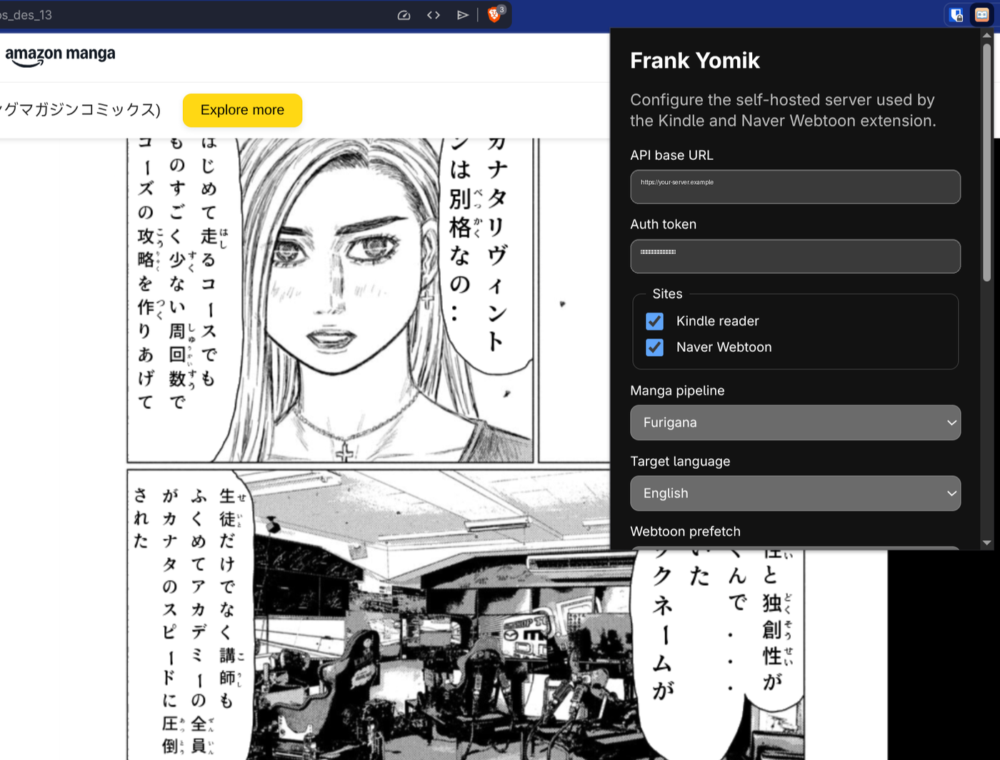

<p align="center">
  
</p>

# Frank Yomik

Automatic manga and webtoon translation system. Detects speech bubbles with RT-DETR-v2, extracts text via OCR, translates with a local LLM (Ollama), and renders the result back onto the page — all running on your own hardware.

<p align="center">
  
  &nbsp;&nbsp;
  
</p>
<p align="center"><em>Left: Japanese → English translation. Right: Furigana reading aids.</em></p>

## Components

| Directory | Language | Description |
|-----------|----------|-------------|
| `server/` | Go + Python | API server, processing pipelines (manga + webtoon), Redis worker |
| `client/` | Dart/Flutter | Android + Linux reader app with WebView overlay |
| `extension/` | JavaScript | Chromium MV3 extension for desktop Kindle/Naver reading |
| `docs/` | — | Test images, screenshots, deployment notes |

## How It Works

**Manga pipeline** (Japanese → English or furigana):
```
Image → RT-DETR-v2 bubble detection → manga-ocr → Ollama translation → English render
                                                 → pykakasi furigana → Vertical JP render
```

**Webtoon pipeline** (Korean → English):
```
Image → EasyOCR text detection → cluster into bubbles → Ollama translation → color-aware render
```

**Web service**: Go API accepts images over HTTP, deduplicates via SHA256, queues through Redis Streams with priority ordering. Python workers process jobs and push results via Redis Pub/Sub + WebSocket.

The protected debug API can also store original/translated page pairs uploaded from the Chromium extension. List recent pairs with `GET /api/v1/debug/pages`.

**Flutter client**: Wraps Kindle (read.amazon.co.jp) and Naver Webtoon in a WebView, captures pages, submits them to the API, and overlays translated images in real-time. Supports auto-translate or manual translate-on-demand, per-volume pipeline selection (furigana vs English), and local SQLite caching.

**Chromium extension**: Runs on desktop Chrome/Chromium, Brave, and Edge. It keeps Kindle and Naver pages visually close to stock: the content script detects the current page image, sends it to your self-hosted server, then swaps in the completed translated/furigana image. All settings live in the extension popup; the bearer token stays in the extension service worker and is never exposed to page scripts.

<p align="center">
  
</p>
<p align="center"><em>Desktop extension configured for a self-hosted server, with Kindle manga running behind it.</em></p>

## Requirements

- Python 3.12+
- [Ollama](https://ollama.ai) with `qwen3:14b` (~9 GB VRAM)
- Go 1.21+
- Redis
- Flutter 3.11+ (for the client app)

## Setup

```bash
git clone https://github.com/akitaonrails/FrankYomik.git
cd FrankYomik/server

python -m venv .venv
source .venv/bin/activate
pip install -r requirements.txt

ollama pull qwen3:14b
```

## CLI Usage

Run from `server/`:

```bash
# Manga: add furigana readings
python process_manga.py furigana

# Manga: translate to English
python process_manga.py translate

# Both + debug bounding boxes
python process_manga.py all --debug

# Webtoon: download and translate a Naver Webtoon chapter
python process_webtoon.py pipeline <URL>
```

Input: `docs/adult*.png` (furigana), `docs/shounen*.png` (translation).
Output: `output/furigana/`, `output/translate/`.

## Web Service

### Local

```bash
# Terminal 1
redis-server

# Terminal 2
cd server && AUTH_TOKEN=secret go run .

# Terminal 3
cd server && python -m worker --pipeline both
```

### Docker Compose

```bash
# Set auth token
echo "AUTH_TOKEN=mysecret" > .env

# Optionally set UID/GID to match your host user (default 1026)
echo "APP_UID=$(id -u)" >> .env
echo "APP_GID=$(id -g)" >> .env

# Build and start
docker compose up -d

# Check status
docker compose logs -f worker
curl -H "Authorization: Bearer mysecret" http://localhost:8080/api/v1/health
```

### Submit a Job

```bash
curl -X POST -H "Authorization: Bearer secret" \
  -F "image=@docs/shounen.png" \
  -F "pipeline=manga_translate" \
  http://localhost:8080/api/v1/jobs

# Poll status
curl -H "Authorization: Bearer secret" http://localhost:8080/api/v1/jobs/<job_id>

# Download result
curl -H "Authorization: Bearer secret" http://localhost:8080/api/v1/jobs/<job_id>/image -o result.png
```

## API

| Method | Path | Description |
|--------|------|-------------|
| POST | `/api/v1/jobs` | Upload image, returns `job_id` |
| GET | `/api/v1/jobs/:id` | Poll job status and metadata |
| GET | `/api/v1/jobs/:id/image` | Download processed image |
| DELETE | `/api/v1/jobs/:id` | Cancel/delete a job |
| GET | `/api/v1/health` | Server + worker + queue status |
| WS | `/api/v1/ws` | Real-time result push |

All endpoints except `/health` require `Authorization: Bearer <token>`.

Pipelines: `manga_translate`, `manga_furigana`, `webtoon`. Priority: `high` (default) or `low` (prefetch).

## Cloudflare Tunnel (Remote Access)

Expose the API over HTTPS via [Cloudflare Tunnel](https://developers.cloudflare.com/cloudflare-one/connections/connect-networks/) so the Flutter client can reach it from anywhere.

### One-time setup

```bash
# Install cloudflared
# Arch: pacman -S cloudflared
# Debian/Ubuntu: see https://developers.cloudflare.com/cloudflare-one/connections/connect-networks/downloads/

# Authenticate with Cloudflare (opens browser)
cloudflared tunnel login

# Create a tunnel
cloudflared tunnel create <tunnel-name>

# Route DNS (requires a domain managed by Cloudflare)
cloudflared tunnel route dns <tunnel-name> <your-hostname>
```

### Configure

Create `.cloudflared/config.yml` in the project root:

```yaml
tunnel: <TUNNEL_UUID>
credentials-file: /etc/cloudflared/<TUNNEL_UUID>.json

ingress:
  - hostname: <your-hostname>
    service: http://api:8080
  - service: http_status:404
```

Copy your tunnel credentials JSON from `~/.cloudflared/<TUNNEL_UUID>.json` into `.cloudflared/`.

### Run with Docker Compose

The `docker-compose.yml` includes `init-cloudflared` and `cloudflared` services. The init container copies credentials from `.cloudflared/` into a Docker volume (avoids filesystem permission issues with NFS or restrictive mounts), then cloudflared connects the tunnel.

```bash
docker compose up -d
```

The API is now reachable at `https://<your-hostname>`. Configure this URL in the Flutter client's Settings screen.

## Flutter Client

```bash
cd client
flutter pub get
flutter run -d linux       # Desktop
flutter run -d <device>    # Android

# Build release APK
flutter build apk --release
```

The client defaults to `http://localhost:8080`. Configure the server URL and auth token in the Settings screen.

## Read a Local Folder with Furigana (Docker, no Kindle)

Read your own manga raws (e.g. `docs/adult/`) with interactive furigana entirely in Docker — no Kindle, no local Flutter/Go/Python toolchain. This runs a lean, **furigana-only** stack (no Ollama/LLM: furigana needs only bubble detection + OCR + MeCab readings) plus the Flutter client as a Linux desktop app you view in your browser via noVNC.

Requirements: Docker with an NVIDIA GPU (Docker Desktop GPU support) and `make`.

```bash
# Configure the environment — build all images (server + GUI). Run once.
make setup

# Run the app — starts redis + API + GPU worker + GUI, then:
make run
```

Open `http://localhost:6080/vnc.html` → **Local folder (furigana)** → enter `/data/adult` → tap a page. The page is submitted to the furigana pipeline, annotated on the GPU, and shown in the interactive viewer: tap a word to mark it known (its furigana hides) or override the reading.

- **Read your own manga**: drop images into `docs/adult/` (mounted read-only at `/data/adult`), or edit the `gui` service mount in `docker-compose.furigana.yml`.
- **Persistence**: known words and settings are saved to `./.frank-appdata` (survives restarts).
- **Other commands**: `make logs` (follow the worker / model loading), `make ps`, `make down`, `make clean`.

The stack is defined in `docker-compose.furigana.yml`; the GUI image is built by `docker/Dockerfile.gui`.

## Chromium Extension

The desktop extension is the lightest way to use Frank Yomik directly on the Kindle Japan reader and Naver Webtoon sites. It supports:

- Kindle Japan: `read.amazon.co.jp`, `read.kindle.co.jp`
- Naver Webtoon: `comic.naver.com`, `m.comic.naver.com`
- Manga pipelines: English translation or furigana annotations
- Webtoon pipeline: Korean → English
- Per-site enable/disable, target-language selection, and webtoon prefetch settings
- Manual force-reprocess and original-vs-translated debug pair upload from the popup

Debug uploads are stored server-side and can be listed with `GET /api/v1/debug/pages`.

### Manual install from a GitHub release

The extension is distributed as a zip asset on the [latest release](https://github.com/akitaonrails/FrankYomik/releases/latest). Chromium does not install this zip directly; load the extracted folder as an unpacked extension:

1. Download `frank-yomik-extension-*.zip` from the latest release assets.
2. Unzip it into a permanent folder, for example `~/Applications/frank-yomik-extension/`. Do not delete this folder after loading it.
3. Open your browser's extension page:
   - Chrome/Chromium/Brave: `chrome://extensions`
   - Edge: `edge://extensions`
4. Enable **Developer mode**.
5. Click **Load unpacked** and select the extracted folder that contains `manifest.json`.
6. Pin/open the **Frank Yomik** extension action.
7. Set the API base URL, auth token, sites, manga pipeline, and target language. Settings autosave when you leave a field; **Save now** is available as a fallback and may trigger the exact API-origin permission prompt.
8. Click **Check server**.
9. Reload any Kindle/Naver tabs that were already open.

To update, download the newer release zip, replace the extracted folder contents, then click the reload button on the extension card in `chrome://extensions`. If you remove and re-add the extension, export settings first because Chromium may clear extension storage.

### Versioning

The Android `versionCode` is derived from `git rev-list --count HEAD` (in `build.gradle.kts`), so every commit automatically produces a higher build number. You only need to bump the display version (`version: X.Y.Z` in `pubspec.yaml`) for releases — the build number takes care of itself.

### Android Sideloading

The APK is distributed directly (not via Google Play) because the app requires a locally-running server with GPU access — it's not a standalone app. To install on Android:

1. Transfer the APK to your phone
2. Enable **Install from unknown sources** for your file manager (Settings → Apps → Special access → Install unknown apps)
3. On Samsung devices, also disable **Auto Blocker** (Settings → Security → Auto Blocker)

This is a one-time setup. Future updates signed with the same key install without prompts.

## Testing

```bash
cd server

# Python unit tests (356 tests)
.venv/bin/pytest tests/unit/ -v

# Python integration tests (34 tests, needs test images in docs/)
.venv/bin/pytest tests/integration/ -v

# Go API tests (needs Redis for full coverage, skips gracefully without it)
go test -v .

# Flutter tests (50 tests)
cd ../client && flutter test
```

## Configuration

All settings in `server/config.yaml`:

| Section | Controls |
|---------|----------|
| `ollama` | Model, URL, temperature, think mode |
| `fonts` | Japanese, English, SFX font paths |
| `ocr` | Device (cpu/cuda) for manga-ocr |
| `text_detection` | EasyOCR confidence and GPU for artwork text |
| `manga_inpainting` | LaMa text removal (off by default) |
| `webtoon` | Scraper, OCR, bubble detection, inpainting |
| `worker` | Redis, consumer group, heartbeat, timeout |

## License

- `server/` — [GNU Affero General Public License v3.0](LICENSE) (AGPL-3.0)
- `client/` — [GNU General Public License v3.0](client/LICENSE) (GPL-3.0)
