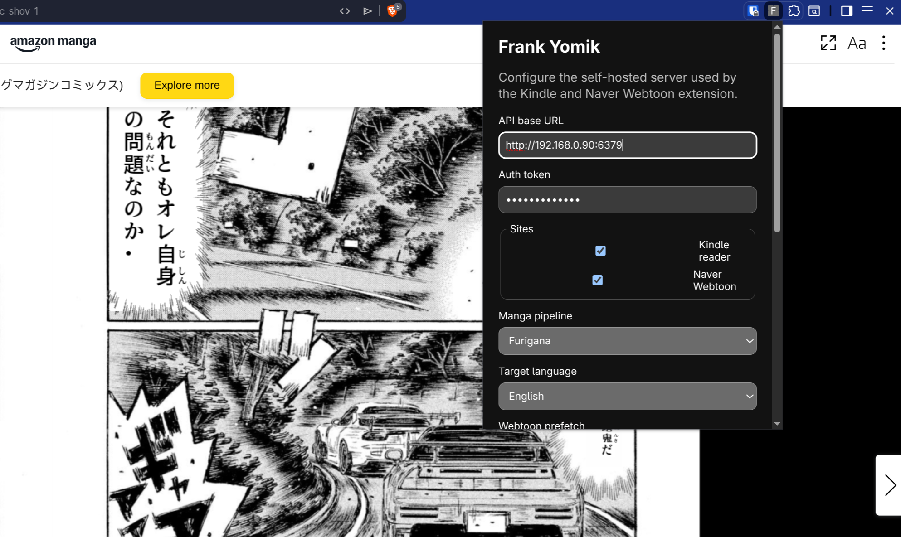

# Frank Yomik Chromium extension

Manifest V3 extension for using a self-hosted Frank Yomik server from desktop Chrome/Chromium.

The extension intentionally keeps Kindle and Naver pages close to vanilla: it does not add in-page buttons, panels, HUDs, or settings overlays. Controls live in the extension popup/options page. Content scripts only detect/capture page images and replace the page image after a translated result is ready.



## Supported sites

- Kindle Japan reader:
  - `https://read.amazon.co.jp/*`
  - `https://read.kindle.co.jp/*`
- Naver Webtoon:
  - `https://comic.naver.com/*`
  - `https://m.comic.naver.com/*`

## Load unpacked

1. Open `chrome://extensions` or `edge://extensions`.
2. Enable **Developer mode**.
3. Click **Load unpacked**.
4. Select this `extension/` directory.
5. Pin/open the **Frank Yomik** extension action.
6. Set:
   - API base URL, for example `https://frank.example.net` or a trusted-LAN URL.
   - auth token matching server `AUTH_TOKEN`.
   - manga pipeline and target language.
7. Click **Save** and allow the exact API-origin permission when Chromium asks.
8. Click **Check server**.
9. Reload any Kindle/Naver tabs that were already open before installing or updating the extension.

For normal development updates, use the reload button on the existing extension card. Removing and re-adding the unpacked extension can clear Chromium extension storage. Use **Export settings** first if you want a backup of the API URL/token.

## Packaged zip

Create a distributable zip from this directory:

```bash
cd extension
npm run package
```

The output lands in `extension/dist/frank-yomik-extension-<version>.zip`. Unzip it into a dedicated directory, then load that directory from `chrome://extensions` with Developer mode enabled.

## Development checks

```bash
cd extension
npm test
```

This validates the manifest, security guardrails, JavaScript syntax, and unit-tested pure helper modules.

## Runtime model

- `src/background/service_worker.js`
  - owns the bearer token
  - submits `/api/v1/jobs`
  - polls job status
  - downloads same-origin result images
  - stores a bounded IndexedDB result cache
- `src/content/kindle.js`
  - detects visible Kindle blob-backed page images
  - captures the exact page image through canvas
  - handles single pages and spreads
- `src/content/webtoon.js`
  - detects Naver Webtoon page images
  - captures image bytes through page fetch first, then a strict pstatic-host background fallback
  - limits concurrent submissions
- `src/content/overlay.js`
  - only replaces image `src` after a completed translation is available

The popup contains a small diagnostics section. If a page is not translating, open the extension popup on that tab and check whether it reports strategy startup, page detection, queued jobs, or errors.

The popup also has **Export settings** and **Import settings** actions. The export file contains the auth token, so keep it private.

## Security notes

- The bearer token is never sent to content scripts.
- The service worker validates sender tab URLs for capture/fetch requests.
- Content scripts run only on the four supported reader hosts.
- The API host permission is requested only for the configured API origin.
- Result image downloads are rejected unless they resolve to the configured API origin.
- Webtoon background image fetching is limited to exact pstatic image hosts and never sends the bearer token.
- Prefer HTTPS for the server. Plain HTTP on a trusted LAN can work, but exposes page images and the token to network observers.
- Extension icons are generated from the Android launcher artwork under `client/android/app/src/main/res/`.

## Current limitations

- The extension uses polling, not WebSocket, for job completion. This avoids long-lived MV3 service-worker assumptions.
- Chrome for Android is not a target; use the existing Android app there.
- If Kindle or Naver changes their DOM/image loading behavior, the content strategies may need updates.
- Existing reader tabs may need a reload after extension install/update because static content scripts only inject on page load.
